<p align="center">
  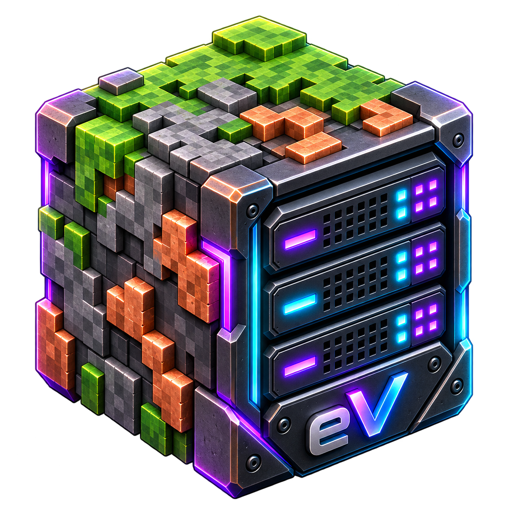
</p>

<h1 align="center">eViSTool</h1>

<p align="center">
  <b>Mod manager and dedicated server tool for Vintage Story</b><br>
  <i>Your world. Your rules.</i>
</p>

<p align="center">
  <a href="https://github.com/erneywhite/eViSTool/actions/workflows/build.yml"></a>
  <a href="https://mods.vintagestory.at/evistool"></a>
  <a href="https://github.com/erneywhite/eViSTool/releases/latest"></a>
  <a href="LICENSE"></a>
  <a href="https://ko-fi.com/erneywhite"></a>
</p>

<p align="center">
  <b>English</b> · <a href="README.ru.md">Русский</a>
</p>

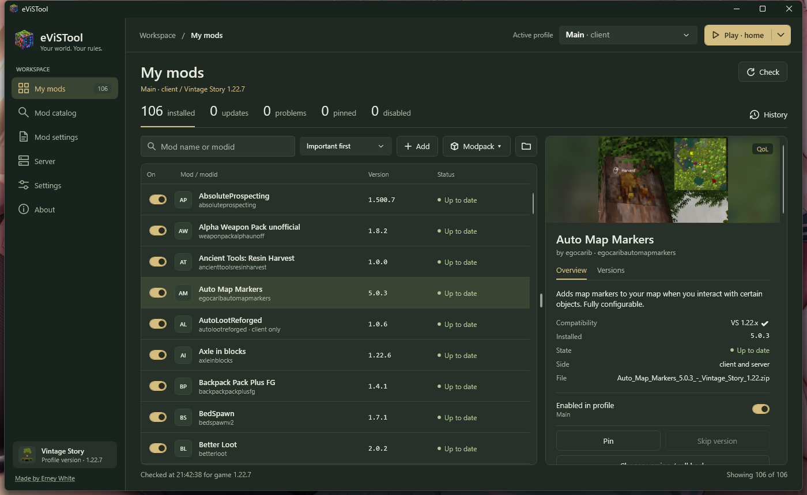

eViSTool keeps your Vintage Story mods up to date, lets you browse and install mods from the ModDB,
and runs your dedicated server — console, players, configuration, backups and scheduled restarts — from one window.
A server on another computer is managed the same way, with a single connection code.

It is portable: unzip it anywhere and run. Nothing is installed into the system — no services, no autostart.

> **Early version (0.x).** Everything described below works and is in daily use. Found a bug or have an idea?
> Tell about it in [Issues](https://github.com/erneywhite/eViSTool/issues) — it really helps.

## Contents

- [Getting started](#getting-started)
- [Profiles](#profiles)
- [My mods](#my-mods)
- [Mod catalog](#mod-catalog)
- [Mod settings](#mod-settings)
- [Crashes and mod errors](#crashes-and-mod-errors)
- [Dedicated server](#dedicated-server)
- [Remote management](#remote-management)
- [Disk cleanup](#disk-cleanup)
- [Updates, data and uninstalling](#updates-data-and-uninstalling)
- [Troubleshooting](#troubleshooting)
- [Building from source](#building-from-source)
- [Code signing policy](#code-signing-policy)

## Getting started

1. Download `eViSTool-<version>-win-x64.zip` from the [ModDB page](https://mods.vintagestory.at/evistool) or from [Releases](https://github.com/erneywhite/eViSTool/releases) — it is the same file.
2. Unzip it into any folder you like (not into the game folder) and run `eViSTool.exe`.
3. eViSTool finds the game and your mods by itself and opens **My mods**.
   If the game is installed somewhere unusual, set its folder in **Settings**.

**Requirements:** Windows 10 or 11 (x64) and the [.NET 10 Desktop Runtime](https://dotnet.microsoft.com/download/dotnet/10.0).
The game client needs the same runtime, so it is already there if you play Vintage Story.
On a machine with only a dedicated server, Windows offers to download the runtime on the first start.

> **"Windows protected your PC"?** eViSTool is not code-signed yet (see [Code signing policy](#code-signing-policy)),
> so SmartScreen may warn about an unknown publisher on the first start. Click **More info → Run anyway**.
> The source code is open, and every release comes with a SHA-256 checksum.

The interface is in English or Russian. It follows the system language, and you can switch it in **Settings**.

## Profiles

A **profile** is one game setup: which game it uses and which data folder (settings, mods, worlds).
The active profile is chosen at the top of the window, and every page works with it.

- **Client profile** — the game you play. **Play** starts the game with this profile:
  its own mods, settings and worlds. The main profile for your usual game is created automatically.
  eViSTool sees when the game of a profile is running: **Play** then says *Game is running* and waits until you close it,
  so the same setup is not started twice.
- **Server profile** — a dedicated server: the folder with `VintagestoryServer.exe` and the server data folder (`--dataPath`).
- **Remote server** — a server on another computer, managed over the network (see [Remote management](#remote-management)).

Profiles are created in **Settings** with **+ Client** and **+ Server**, or copied from an existing one with **Clone…**.
Client profiles show the icon of your installed game.

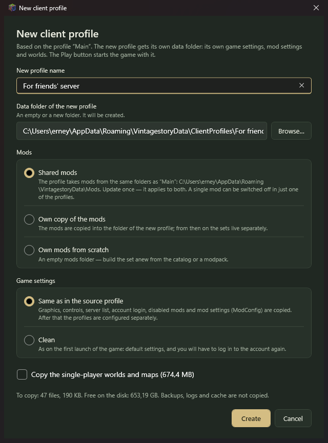

**A new client profile** is handy for a second mod set — for one particular server, for testing, for a modpack.
It gets its own data folder, and you choose:

- **Mods:** *shared* with the source profile (update once — both get it; a mod can still be switched off in just one of them),
  *own copy* (from then on the sets live separately) or *own mods from scratch* (an empty folder).
- **Game settings:** *same as in the source profile* — graphics, controls, server list, account login and mod settings are copied,
  so you don't have to log in again — or *clean*, as on the very first start of the game.
- **Worlds:** copy the single-player worlds and maps, or start without them.

**A new server profile** starts with an empty data folder — the server fills it on its first start.
If you already have a server (the standard `VintagestoryData` or your own `--dataPath`), use **Already have server data?**:

- **Copy into a new profile** — configs, world, mod settings and player data are copied, the original folder stays untouched;
- **Use as it is** — the profile works right in that folder.

A server profile is cloned with the same world or with a fresh one. Removing a profile asks whether to also move
its data folder to the Recycle Bin — nothing is deleted without asking.

## My mods

Everything installed in the active profile: name, version, side and status. The counters on top and the chips above the table
filter the list — updates, problems, pinned, disabled. Click a mod to open its card on the right: description and screenshots
from the ModDB, compatibility, file, and all actions for it.

**Check** asks the ModDB about every installed mod (it can also run on start — see **Settings**). The status shows the result:

| Status | Meaning |
|---|---|
| Up to date | You have the latest version for your game version. |
| Update available | A newer version for your game version is on the ModDB. |
| No version for game | The ModDB has no release of this mod for your game version. |
| Not on ModDB | The mod is not on the ModDB (installed by hand) — nothing to compare with. |
| Not checked | The list was read from disk, but the ModDB was not asked yet. |

**Updating.** **Update** on a mod, or **Update all**. Installs go through a queue at the bottom of the window:
you can keep working, add more, stop the queue and retry failed items.
Replaced versions are kept (the last three per mod), so any update can be undone.

**Choose version / roll back** installs any release for your game version from the ModDB, or a saved copy of
a version you had before. **Pin** keeps a mod on its current version (no updates are offered);
**Skip version** hides one particular release and offers the next one.

**Enable and disable** with the switch. eViSTool writes the same setting the game's own mod manager does,
so the game sees it exactly the same way. Do it with the game closed: the game rewrites its settings on exit.

**Dependencies.** If an enabled mod needs another mod that is missing, outdated or disabled, a banner appears above the table.
**Fix** downloads what is missing from the ModDB and enables what is disabled.

**Needs a newer game.** If a mod's own files say it needs a newer game than the profile has (say 1.22.8 while you have 1.22.7),
its status is *Needs game 1.22.8*: the game would not load it. eViSTool also looks inside a downloaded mod before installing it
and asks first, updates included — the ModDB marks releases only by branch (1.22.x), so the mod file is the only place that says it.

**World copies.** Before the mods of a game profile change, eViSTool copies the single-player worlds you played since the last copy —
one copy per world, kept next to the worlds in the profile's data folder (`eViSTool-world-copies`). If an update breaks a world,
open **Settings → the profile → World copies** and press **Put back**. The world it replaces is set aside in the same list,
so this can be undone too. It is on by default (**Copy single-player worlds before changing mods** in **Settings**).
Data that mods keep next to the worlds (for example `Saves/XLeveling`) is shared by all worlds and is not part of these copies.

**Adding mods by hand.** **Add**, or just drag zip files onto the list. If it is the same version, an older one or a mod
that is already installed, eViSTool asks before replacing. **Delete** moves the file to the Recycle Bin.

**Modpacks.** **Modpack → Create modpack…** saves your set as one `.evpack` file: either a list of ModDB mods
(small, the mods are downloaded on import) or with the mod files inside, optionally with mod settings (`ModConfig`).
**Import modpack…** shows what will be installed, updated or disabled before changing anything.
Import works for a server on another computer too. Afterwards eViSTool offers to put the same mods into linked profiles,
like **Also install into**.

The list refreshes by itself when mods change outside the window — in another eViSTool window or by copying files by hand.

## Mod catalog

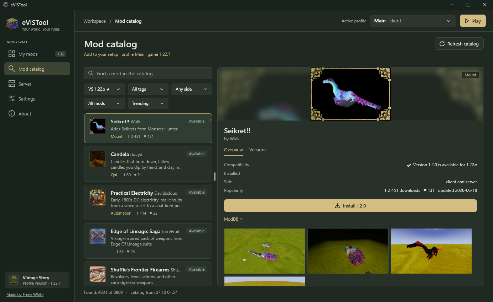

The whole ModDB inside the app: search by name, description, author or modid; filter by tag, side and game version;
sort by trending, downloads, follows or recent updates. By default only mods with a release for your game version are shown
(★ marks the version of the active profile — a remote server's one too). If the release you pick is marked for another
game version, eViSTool asks before installing it.

A mod's card has its screenshots, description and every release. **Install** takes the right version for your game
and offers to install missing dependencies. Installed mods are marked in the list.
The catalog is cached for 6 hours; **Refresh catalog** downloads a fresh one.

**Also install into.** Many mods are needed in more than one place: a mod for both sides goes onto your server *and* into
the client profile you play on it with. When you install such a mod, eViSTool offers the other profiles where it belongs.
Tick the ones you want; each profile gets the release for its own game version, and what is already there is shown.
The same works for mod files added by hand and for missing dependencies.

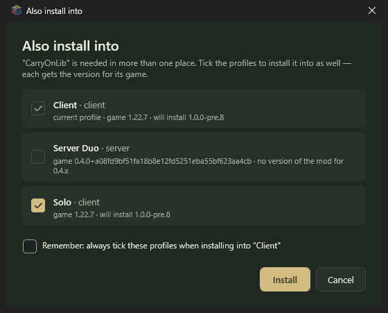

**Remember** links the profiles: next time they are ticked already. With **Install mods into linked profiles without asking**
(**Settings**) the window is skipped altogether, and a mod goes into the linked profiles straight away — the window appears only
if one of them cannot take the mod.

## Mod settings

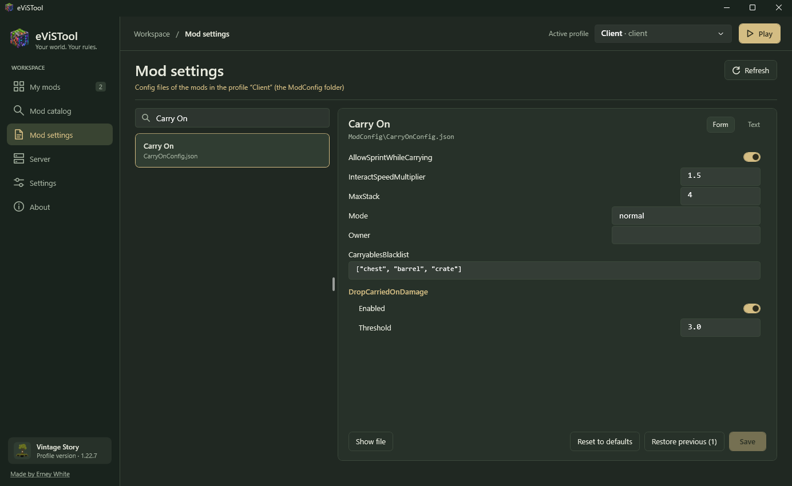

Most mods keep their settings in the `ModConfig` folder of the profile. **Mod settings** lists those files with the mod each
one belongs to (guessed from the file name — files of removed mods are marked too), and opens the one you pick:

- JSON files open as a **form**: switches for yes/no, fields for numbers and text, lists as `["a", "b"]`, nested settings in groups.
  Wrong values are pointed out right in the field, and nothing broken can be saved. The **Text** view shows the file as it is;
  files with comments open there, because saving from the form would drop the comments.
- Before every save the previous version is kept (the last 5 per file). **Restore previous** brings it back — each press goes one step further back.
- **Reset to defaults** removes the file, and the mod creates it again with default values the next time the game starts.
  This can be undone with **Restore previous** too.
- A mod's card in **My mods** has a **Mod settings** link when the mod has config files.

The game reads the settings when it starts, so a change applies after a restart; eViSTool warns if the game is running.
A server on another computer works the same way: its files are edited through the connection, and the previous versions are kept on that computer.

## Crashes and mod errors

When something breaks, eViSTool reads the game's logs and tells you which mod is most likely to blame —
so you don't have to dig through a stack trace or disable mods one by one.

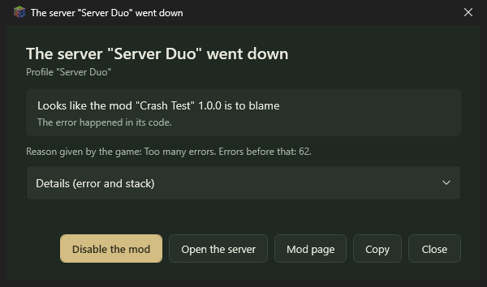

- **The game crashed** or **the world closed because of an error** (you got thrown back to the main menu):
  a window pops up with the mod, how it was found and the error.
- **A dedicated server went down** on its own: the agent works out the culprit, the server console gets a line about it,
  and the window tells you — for every server profile, remote ones included, whichever profile is active right now.

The mod is found from the game's own crash report, from the stack of the error, from a mod tag in the message,
or from the mod's translation strings. From the window you can **Disable the mod** (for a running game it happens as soon
as you close it — otherwise the game would overwrite the setting), find it in **My mods**, open its ModDB page,
or **Copy** the whole report to send to the mod author. If no mod can be named, the details are still there for a forum post.

**Mod errors.** Some mods keep throwing errors the game swallows: nothing crashes, but the log swells and the game stutters.
eViSTool counts them during each run of the game or the server. If a mod gets noisy, a yellow **!** appears next to the profile
at the top of the window. Click it to see which mods and how many errors, with an example of each.

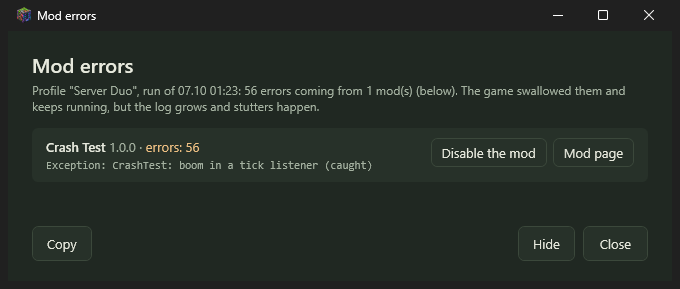

**Hide** removes the **!** until the next run that has errors.

## Dedicated server

Pick a server profile and open **Server**.

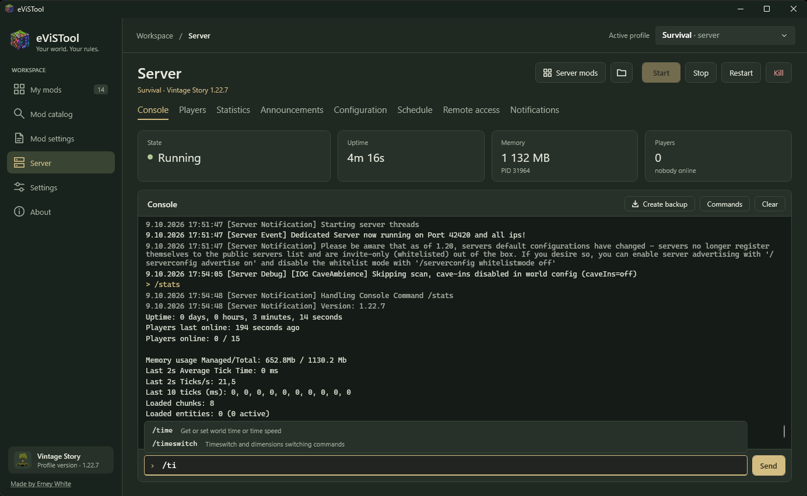

**Start, Stop, Restart** and a live **Console** with command history (↑/↓) and command hints: start typing `/` and the server's
commands pop up with their arguments, **Tab** completes. **Commands** lists them all with search. The list comes from the server
itself (its `/help`), so commands added by mods are there too. **Stop** saves the world;
**Kill** ends the process at once and is only for a server that hangs.
On top: state, uptime, memory and who is online since when.

**The agent.** The server is owned by a small background program, `eViSTool.Agent.exe`, next to `eViSTool.exe`.
Close the window — the server keeps running; open it again — you are back in the same console.
If the server crashes, the agent starts it again. The agent exits by itself once the server is stopped and the window is closed:
nothing stays in the background, and nothing starts with Windows.

**Configuration** edits `serverconfig.json` with proper fields: general settings, world settings, roles and privileges
with checkboxes, and everything else as a list — unknown keys are kept as they are. The server rewrites this file when it stops,
so changes can be saved only while it is stopped. A copy of the previous file stays next to it (`.evistool.bak`).

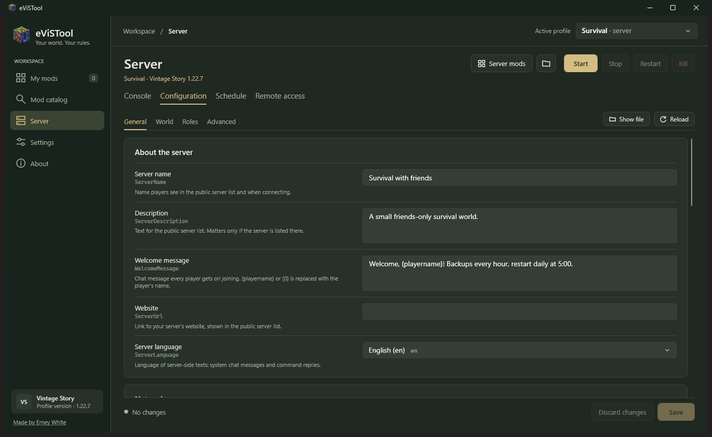

**Schedule.** Both parts are run by the agent, so they work with the window closed:

- **World backups** every N hours. The server itself makes the copy into the `Backups` folder of the profile;
  old copies are rotated (keep the last N), optionally only if someone played, with an announcement in chat.
  **Restore** puts a backup in place of the world (with the server stopped). The current world is saved aside first,
  so a restore can be undone.
  Data that mods keep next to the world rather than in it (for example `Saves/XLeveling` with skill progress,
  and the `ModData` folder) is packed with every backup and restored together with the world.
- **Scheduled restarts** every N hours of uptime or at set times of day, with chat warnings
  (10 and 5 minutes before, then every minute) and, if you like, a fresh backup right before the restart.
  With **Update mods on restart** on, the agent installs released mod updates while the server is stopped.
  Pinned mods and skipped versions are left alone, and what was updated is written to the console.

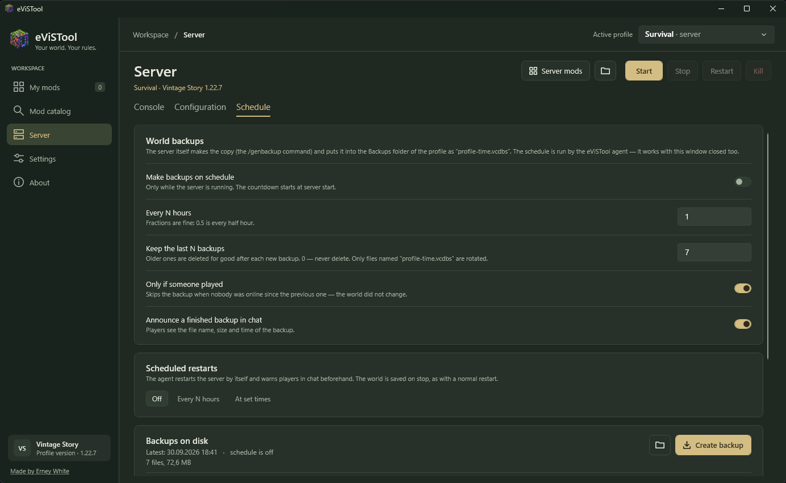

**Players.** Everyone who has joined the server, with search and last join time; whoever is in game now has a dot.
Here you set the role, whitelist, ban with duration and reason, **Kick** and **Class and look**: the player may change
class and appearance once, and if they are in game, they get a chat message saying to type `.charsel`.
At the top: a **Whitelist only** switch and adding by name (works for those who have never joined too);
at the bottom: the full whitelist and bans.

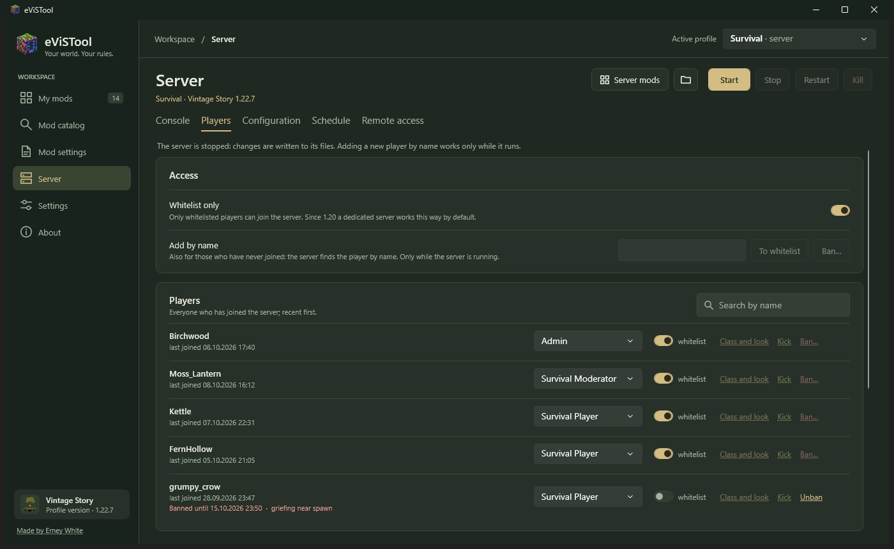

While the server runs, changes go to it as commands: you see them in the console, and the server's reply shows in the tab.
On a stopped server eViSTool edits the server files. A new player can be added by name only while the server runs:
only the server can look a player up by name. Since 1.20 a dedicated server lets in only whitelisted players by default,
so you will most likely need to add your friends there.

**Server mods** opens **My mods** for the server profile — the same table, catalog and updates as for the game.

## Remote management

Manage a server on another computer — a home PC, a spare laptop, a rented machine — as if it were here:
console, start and stop, configuration, schedule, backups, players and the server's mods. One string, the **connection code**,
carries everything needed: address, port, key and the server's certificate. There is nothing to configure by hand.

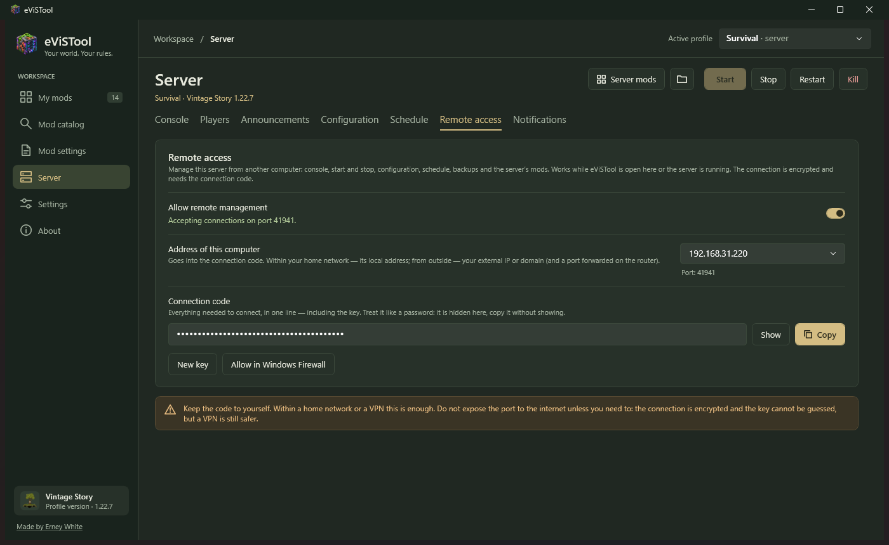

**On the server computer:**

1. Run eViSTool there and pick the server profile.
2. Open **Server → Remote access** and turn on **Allow remote management**. A random port is chosen once and then kept.
3. In **Address of this computer**, pick how the other computer will reach it: within your home network — the local address
   (like `192.168.1.20`); from outside — your external IP or domain.
4. Press **Allow in Windows Firewall** (Windows asks for administrator rights), then **Copy** the code.

**On your computer:** **Settings → + Server → Server on another computer? → Connect by code…**, paste the code,
press **Check connection** and create the profile. Pick it at the top of the window — **Server** and **My mods**
now work with the remote server.

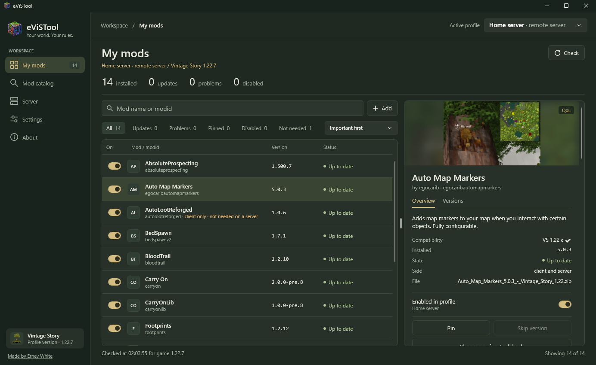

Good to know:

- The server computer needs eViSTool open, or its server running: remote access lives as long as the agent does.
  There is no service and no autostart.
- Changes show up in both windows by themselves. A mod disabled from your PC appears disabled on the server computer
  within seconds, and the other way round. The same goes for the schedule and the configuration.
- Mods are installed on the server over the connection: from a zip, from the catalog, as updates and from modpacks.
- Keep eViSTool updated on both computers. An agent of an older version is replaced by itself while the server is stopped;
  until then a note says so.

**Security.** The connection is encrypted (TLS), and eViSTool checks that it talks to exactly the server from the code —
another computer at the same address is not accepted. Without the key nobody can connect; after five wrong keys
connections are refused for a minute. The code is hidden on screen and copied without showing; on your computer it is stored
encrypted for your Windows account. If the code got into the wrong hands, **New key** makes the old code useless.

**Over the internet** you also need to forward the port on your router to the server computer.
A VPN (Tailscale, ZeroTier, WireGuard and the like) is simpler and safer: use the VPN address of the server computer,
and nothing is exposed to the internet.

## Disk cleanup

Over time the game piles up gigabytes: every mod version it ever unpacked, mods downloaded from servers you no longer play on,
maps of old worlds. **Settings → the profile → Disk cleanup…** shows what the game and eViSTool keep for that profile, grouped,
with sizes and dates:

- **safe** — the game or eViSTool recreate it when needed: unpacked mods (`Cache\unpack`), mods downloaded from servers,
  old logs, saved versions of mods that are no longer installed, unfinished downloads;
- **careful** — something you may still want: world maps (the explored map of that world starts empty again), data of mods
  that are not installed, mod data per world, settings files without a mod, saved versions of installed mods (needed to roll back).

Only the safe things that are surely not needed are selected by default (for example, mods of servers you have not joined
for a month). Everything you remove goes to the Windows Recycle Bin, so a mistake can be undone — the space is freed once
the Recycle Bin is emptied. While the game or the server of the profile is running, cleanup waits: they keep these files open.
It works for game and server profiles on this computer.

## Updates, data and uninstalling

**Updates.** On start eViSTool checks GitHub for a new release. **About → Update to …** downloads it, verifies the checksum
and replaces the program. A running server is not interrupted.

**Your data** — settings, saved versions of mods, downloads and logs — lives in the `data` folder next to `eViSTool.exe`.
Move the program folder, and everything moves with it. (If eViSTool cannot write there, for example in `Program Files`,
it uses `%LOCALAPPDATA%\eViSTool` instead.)

**What eViSTool changes:** only mod folders, the game and server settings files (keeping a `.evistool.bak` copy of the previous state),
backups in the `Backups` folder of server profiles, and the data folders of profiles it created.
Deleted mods, backups and profile folders go to the Recycle Bin.

**To uninstall,** stop your servers, close eViSTool and delete its folder.

## Troubleshooting

**The game or its version is not found.** Settings → the profile → **Game folder**: the folder with `Vintagestory.exe`
(or `VintagestoryServer.exe` for a server).

**A mod is "Not on ModDB".** It was installed by hand, or its `modid` differs from the one on the ModDB. It works as usual,
there is just nothing to compare it with — update it by hand.

**Enabling or disabling a mod does not stick.** The game was running and rewrote its settings on exit. Close the game and switch it again.

**"A server from this game folder is already running, but not under eViSTool".** It was started elsewhere, for example by another tool.
**Stop gently** sends it Ctrl+C so it saves the world; then start it from eViSTool.

**Remote: no connection.** Check, in this order: eViSTool is open on the server computer (or its server is running) and remote access is on;
the address in the code fits where you are (a local address works only within the same network); the port is allowed in the firewall
(**Allow in Windows Firewall**); over the internet — the port is forwarded on the router.
**"The key does not match"** — the key was changed on the server, get a new code. **"The server did not present the certificate"** —
a different computer answers at that address.

Anything else — [open an issue](https://github.com/erneywhite/eViSTool/issues) and attach the log from `data\logs` if there is one.

## Building from source

Requires the [.NET 10 SDK](https://dotnet.microsoft.com/download).

```
dotnet build
dotnet test
pwsh build/publish.ps1   # release build and zip in dist/
```

Projects: `eViSTool.Core` — mods, ModDB, profiles, configs, backups, remote access; `eViSTool.Agent` — background agent that owns
the server process; `eViSTool.App` — WPF interface; `tests/eViSTool.Core.Tests` and `tests/eViSTool.App.Tests` — tests.

## Code signing policy

eViSTool releases are not code-signed yet. The plan is free code signing for open-source projects —
provided by [SignPath.io](https://signpath.io), certificate by [SignPath Foundation](https://signpath.org) —
once the project is known well enough to qualify for their program.

Only binaries built by [GitHub Actions](https://github.com/erneywhite/eViSTool/actions/workflows/build.yml) from the source code
in this repository are signed — never files built on a personal computer.

**Team roles**

- Committers and reviewers: [Erney White](https://github.com/erneywhite)
- Approvers (release signing): [Erney White](https://github.com/erneywhite)

**Privacy**

eViSTool does not collect or send any personal data or usage statistics. It connects to other systems only for its features:

- **GitHub** (`api.github.com`, `github.com`) — to check for and download eViSTool updates;
- **Vintage Story ModDB** (`mods.vintagestory.at`) — for the mod catalog, update checks and to download the mods you choose;
- **your own server computer** — only if you turn on remote management, and only with the connection code you created.

Settings, logs and saved mod versions stay on your computer in the `data` folder. eViSTool changes system settings only when
you ask it to: **Allow in Windows Firewall** adds an inbound rule for the remote access port after a Windows administrator prompt.
To uninstall, delete the program folder (see [Updates, data and uninstalling](#updates-data-and-uninstalling)).

## Support

eViSTool is free. If it saves you time, you can [buy me a coffee on Ko-fi](https://ko-fi.com/erneywhite) — it really helps keep it going.

## Credits and license

- [Rustique](https://github.com/Tekunogosu/Rustique) by Tekunogosu (MIT) — the ModDB and version logic is based on it.
- [ViSST Server Tool](https://mods.vintagestory.at/show/mod/17652) by THumbert — ideas for server management.

eViSTool is licensed under the [GNU General Public License v3.0](LICENSE). Third-party notices: [THIRD-PARTY-NOTICES.md](THIRD-PARTY-NOTICES.md).

Vintage Story is a game by Anego Studios. eViSTool is an unofficial fan-made tool and is not affiliated with Anego Studios.

© 2026 Erney White
