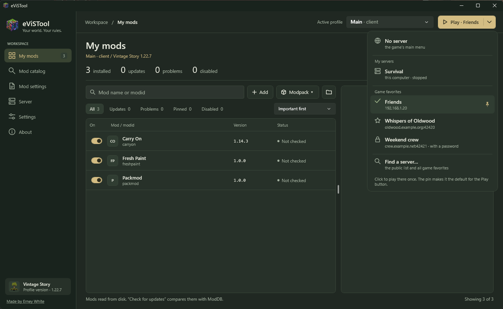
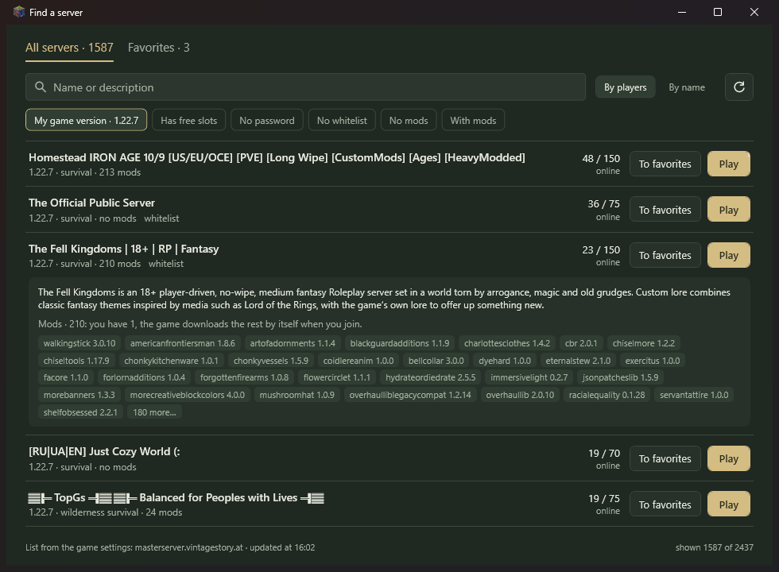
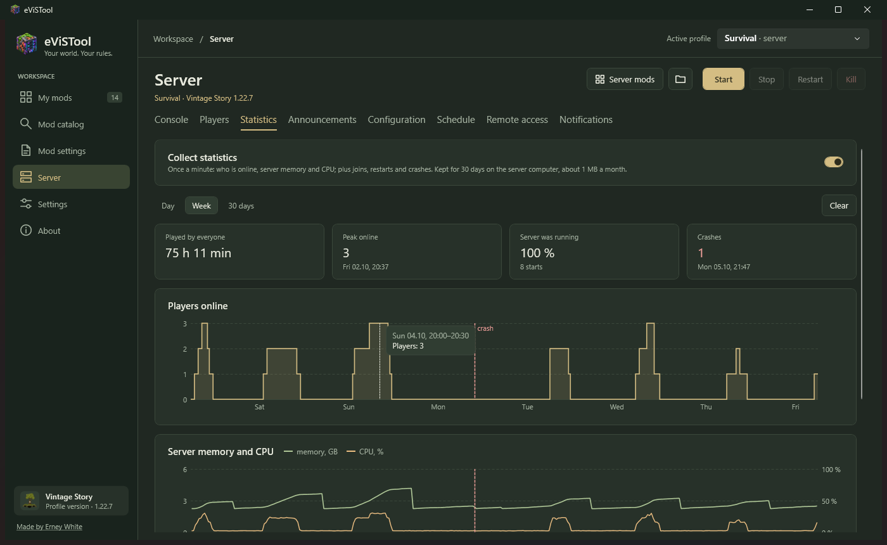
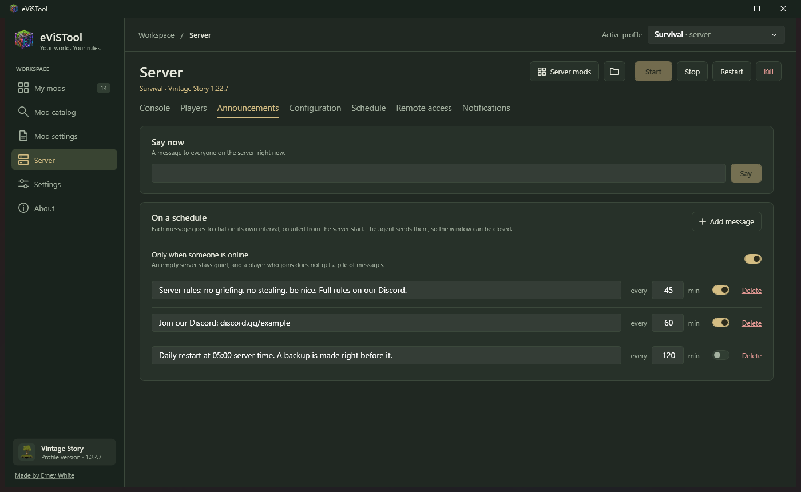
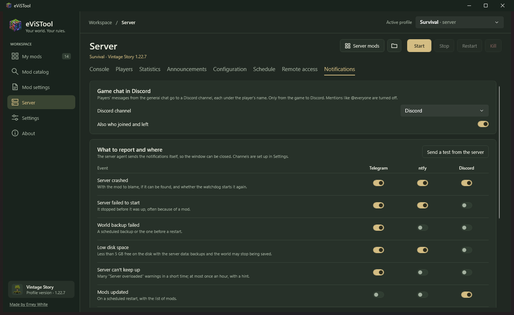
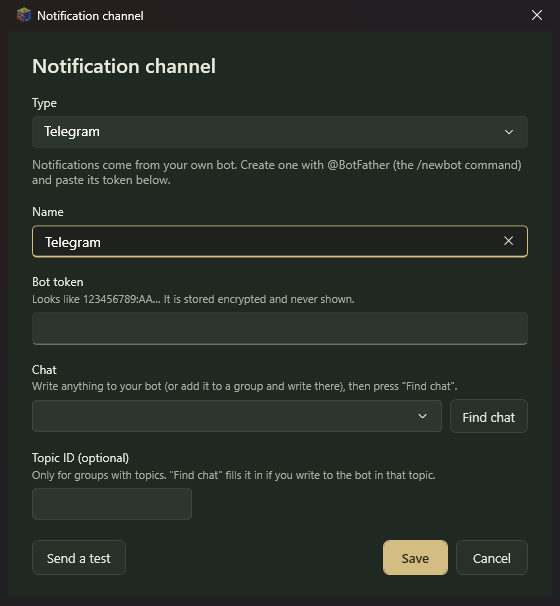

<p align="center">
  
</p>

<h1 align="center">eViSTool</h1>

<p align="center">
  <b>Менеджер модов и инструмент для выделенного сервера Vintage Story</b><br>
  <i>Твой мир. Твои правила.</i>
</p>

<p align="center">
  <a href="https://github.com/erneywhite/eViSTool/actions/workflows/build.yml"></a>
  <a href="https://mods.vintagestory.at/evistool"></a>
  <a href="https://github.com/erneywhite/eViSTool/releases/latest"></a>
  <a href="LICENSE"></a>
  <a href="https://ko-fi.com/erneywhite"></a>
</p>

<p align="center">
  <a href="README.md">English</a> · <b>Русский</b>
</p>


eViSTool держит моды Vintage Story в актуальном состоянии, показывает каталог модбазы с установкой в один клик
и управляет выделенным сервером из одного окна: консоль, игроки, конфигурация, резервные копии, перезапуски по расписанию,
оповещения и статистика.
Сервером на другом компьютере можно управлять так же — по одной строке, коду подключения.

Программа портативная: распаковал в любую папку и запустил. В систему ничего не ставится — ни служб, ни автозапуска.

> **Ранняя версия (0.x).** Всё описанное ниже работает и используется каждый день. Нашёл ошибку или есть идея?
> Пиши в [Issues](https://github.com/erneywhite/eViSTool/issues) — это правда помогает.

*Скриншоты — в английском интерфейсе; программа сама выбирает русский, если он у системы.*

## Содержание

- [Начало работы](#начало-работы)
- [Профили](#профили)
- [Мои моды](#мои-моды)
- [Каталог модов](#каталог-модов)
- [Настройки модов](#настройки-модов)
- [Вылеты и ошибки модов](#вылеты-и-ошибки-модов)
- [Выделенный сервер](#выделенный-сервер)
- [Удалённое управление](#удалённое-управление)
- [Уборка диска](#уборка-диска)
- [Обновления, данные и удаление](#обновления-данные-и-удаление)
- [Если что-то не так](#если-что-то-не-так)
- [Сборка из исходников](#сборка-из-исходников)
- [Политика подписи кода](#политика-подписи-кода)

## Начало работы

1. Скачай `eViSTool-<версия>-win-x64.zip` [со страницы на модбазе](https://mods.vintagestory.at/evistool) или в [Releases](https://github.com/erneywhite/eViSTool/releases) — файл один и тот же.
2. Распакуй в любую удобную папку (не в папку игры) и запусти `eViSTool.exe`.
3. Игру и моды eViSTool найдёт сам и откроет **«Мои моды»**.
   Если игра стоит в необычном месте — укажи её папку в **«Настройках»**.

**Требования:** Windows 10 или 11 (x64) и [.NET 10 Desktop Runtime](https://dotnet.microsoft.com/download/dotnet/10.0).
Он же нужен клиенту игры, так что если ты играешь в Vintage Story, он уже установлен.
На машине только с сервером Windows сама предложит скачать его при первом запуске.

> **«Система Windows защитила ваш компьютер»?** У eViSTool пока нет цифровой подписи (см. [Политику подписи кода](#политика-подписи-кода)),
> поэтому SmartScreen при первом запуске может предупредить о неизвестном издателе. Нажми **«Подробнее» → «Выполнить в любом случае»**.
> Исходный код открыт, а к каждому релизу приложена контрольная сумма SHA-256.

Интерфейс — на русском или английском: по языку системы, переключается в **«Настройках»**.

## Профили

**Профиль** — это одна сборка игры: какая игра и какая папка данных (настройки, моды, миры).
Активный профиль выбирается вверху окна, и все разделы работают с ним.

- **Клиентский профиль** — игра, в которую ты играешь. **«Играть»** запускает игру с этим профилем:
  со своими модами, настройками и мирами. Основной профиль для обычной игры создаётся сам.
  eViSTool видит, что игра профиля запущена: тогда на кнопке **«Игра запущена»**, и она ждёт, пока ты закроешь игру, —
  одну и ту же сборку дважды не запустить.
- **Серверный профиль** — выделенный сервер: папка с `VintagestoryServer.exe` и папка данных сервера (`--dataPath`).
- **Удалённый сервер** — сервер на другом компьютере, управляется по сети (см. [Удалённое управление](#удалённое-управление)).

**Играть сразу на сервере.** Стрелка рядом с **«Играть»** открывает меню: «Без сервера», твои серверы из eViSTool
(со своим компьютером и в виртуалке, с состоянием: запущен ли и сколько в игре) и избранное игры. Пункт меню запускает игру
и сразу подключает к серверу, минуя меню игры. Булавка делает сервер основным: тогда на кнопке, например, **«Играть · home»**,
и одно нажатие заводит прямо туда. То же выбирается в **«Настройках»** у клиентского профиля — **«Сервер для кнопки «Играть»»**.



**«Найти сервер…»** в том же меню открывает общий список серверов — тот же, что в браузере серверов самой игры (адрес берётся
из её настроек). Поиск, фильтры (своя версия игры, есть места, без пароля, без белого списка, с модами или без) и сортировка;
нажатие на сервер раскрывает его описание и моды — с подсказкой, сколько из них у тебя уже есть. Оттуда же можно сразу играть
или добавить сервер в избранное игры. На вкладке **«Избранное»** — всё избранное целиком: **«Добавить сервер»** вручную
(название, адрес, пароль), **«Изменить»** и **«Убрать»**. Избранное меняется только при закрытой игре: при выходе она его перезаписывает.



Профили создаются в **«Настройках»** кнопками **«+ Клиент»** и **«+ Сервер»** или копируются из существующего — **«Клонировать…»**.
У клиентских профилей — значок твоей установленной игры.


**Новый клиентский профиль** удобен для второго набора модов — под конкретный сервер, для проверки, под модпак.
У него своя папка данных, а остальное выбираешь сам:

- **Моды:** *общие* с исходным профилем (обновил один раз — получили оба; при этом мод можно выключить только в одном из них),
  *своя копия* (дальше наборы живут отдельно) или *свои моды с нуля* (пустая папка).
- **Настройки игры:** *как в исходном профиле* — графика, управление, список серверов, вход в аккаунт и настройки модов копируются,
  заново входить не придётся, — или *чистые*, как при самом первом запуске игры.
- **Миры:** скопировать одиночные миры и карты или начать без них.

**Новый серверный профиль** начинается с пустой папки данных — сервер заполнит её при первом запуске.
Если сервер у тебя уже есть (стандартная `VintagestoryData` или своя `--dataPath`), используй **«Уже есть данные сервера?»**:

- **«Скопировать в новый профиль…»** — конфиги, мир, настройки модов и данные игроков копируются, исходная папка не меняется;
- **«Использовать как есть»** — профиль работает прямо в этой папке.

Серверный профиль клонируется с тем же миром или с новым. При удалении профиля программа спросит, убрать ли в корзину
и его папку данных, — без вопроса ничего не удаляется.

## Мои моды

Всё, что установлено в активном профиле: название, версия, сторона и состояние. Счётчики сверху и фильтры над таблицей
отбирают список: обновления, проблемы, закреплённые, выключенные. Щёлкни мод — справа откроется его карточка: описание и скриншоты
с модбазы, совместимость, файл и все действия с ним.

**«Проверить»** спрашивает модбазу обо всех установленных модах (можно и автоматически при запуске — см. **«Настройки»**).
Результат — в колонке состояния:

| Состояние | Что значит |
|---|---|
| Актуален | У тебя последняя версия для твоей версии игры. |
| Есть обновление | На модбазе есть более новая версия для твоей версии игры. |
| Нет версии для игры | На модбазе нет релиза этого мода под твою версию игры. |
| Нет в модбазе | Мода нет на модбазе (поставлен вручную) — сравнивать не с чем. |
| Не проверялся | Список прочитан с диска, но модбазу ещё не спрашивали. |

**Обновление.** **«Обновить»** у мода или **«Обновить всё»**. Установка идёт через очередь внизу окна:
можно работать дальше, добавлять ещё, остановить очередь и повторить неудавшиеся.
Заменённые версии сохраняются (по три последних на мод), так что любое обновление можно откатить.

**«Выбрать версию / откат»** ставит любой релиз под твою версию игры с модбазы или сохранённую копию версии,
которая стояла раньше. **«Закрепить»** оставляет мод на текущей версии (обновления не предлагаются),
**«Пропустить»** прячет один конкретный релиз и предлагает следующий.

**Включение и выключение** — переключателем. eViSTool пишет ту же настройку, что и встроенный менеджер модов игры,
так что игра видит её точно так же. Делай это при закрытой игре: при выходе игра перезаписывает свои настройки.

**Зависимости.** Если включённому моду нужен другой мод, а его нет, он устарел или выключен, над таблицей появится плашка.
**«Исправить»** скачает недостающее с модбазы и включит выключенное.

**Нужна игра новее.** Если в файлах самого мода сказано, что ему нужна игра новее, чем у профиля (скажем, 1.22.8, а у тебя 1.22.7),
в состоянии будет *«Нужна игра 1.22.8»*: игра такой мод не загрузит. А перед установкой eViSTool заглядывает в скачанный мод
и сначала спрашивает — и при обновлении тоже: модбаза помечает релизы только веткой (1.22.x), точное требование есть лишь в самом файле.

**Копии миров.** Перед изменением модов игрового профиля eViSTool копирует одиночные миры, в которые играли с прошлой копии, —
по одной копии на мир, рядом с мирами в папке данных профиля (`eViSTool-world-copies`). Если обновление испортило мир —
**«Настройки» → профиль → «Копии миров» → «Вернуть»**. Мир, который он заменил, откладывается в тот же список,
так что и это можно отменить. Включено по умолчанию (**«Копировать одиночные миры перед изменением модов»** в **«Настройках»**).
Данные, которые моды хранят рядом с мирами (например, `Saves/XLeveling`), общие для всех миров и в эти копии не входят.

**Свои моды.** **«Добавить»** или просто перетащи zip-файлы на список. Если это та же версия, более старая или уже
установленный мод, eViSTool спросит, прежде чем заменять. **«Удалить»** убирает файл в корзину.

**Модпаки.** **«Модпак» → «Собрать модпак…»** сохраняет твой набор одним файлом `.evpack`: либо списком модов с модбазы
(маленький файл, моды скачаются при импорте), либо с файлами модов внутри, по желанию — с настройками модов (`ModConfig`).
**«Импортировать модпак…»** сначала показывает, что будет поставлено, обновлено или выключено, и только потом что-то меняет.
Импорт работает и для сервера на другом компьютере. После него eViSTool предложит поставить те же моды в связанные профили,
как **«Установить также в»**.

Список обновляется сам, если моды поменялись не в этом окне — в другом окне eViSTool или файлы скопировали вручную.

## Каталог модов


Вся модбаза внутри программы: поиск по названию, описанию, автору и modid; фильтры по тегу, стороне и версии игры;
сортировка по популярности, загрузкам, подпискам и свежести обновлений. По умолчанию показаны только моды с релизом
под твою версию игры (★ — версия активного профиля, в том числе удалённого сервера). Если выбранный релиз помечен
для другой версии игры, eViSTool спросит, прежде чем ставить.

В карточке мода — скриншоты, описание и все релизы. **«Установить»** берёт подходящую версию под твою игру
и предлагает доставить недостающие зависимости. Установленные моды отмечены в списке.
Каталог хранится 6 часов; **«Обновить каталог»** скачивает свежий.

**«Установить также в».** Многие моды нужны не в одном месте: мод для обеих сторон ставится и на сервер, *и* в клиентский
профиль, которым ты на нём играешь. Когда ставишь такой мод, eViSTool предложит другие профили, где он нужен.
Отметь нужные — каждому подберётся релиз под его версию игры, а что там уже стоит, будет видно сразу.
Так же это работает для модов, добавленных файлами, и для недостающих зависимостей.


**«Запомнить»** связывает профили: в следующий раз они уже отмечены. С тумблером **«Ставить моды в связанные профили без вопроса»**
(**«Настройки»**) окно не появляется вовсе — мод сразу встаёт и в связанные профили; окно покажется, только если в какой-то
из них поставить нельзя.

## Настройки модов


Большинство модов хранят свои настройки в папке `ModConfig` профиля. **«Настройки модов»** показывают эти файлы с модом,
которому принадлежит каждый (угадывается по имени файла; файлы удалённых модов тоже отмечены), и открывают выбранный:

- JSON-файлы открываются **формой**: переключатели для да/нет, поля для чисел и текста, списки вида `["a", "b"]`, вложенные
  настройки — группами. Неверное значение подсвечивается прямо в поле, а сломанное сохранить нельзя. Вид **«Текст»** показывает
  файл как есть; файлы с комментариями открываются в нём, потому что сохранение из формы комментарии уберёт.
- Перед каждым сохранением прежняя версия откладывается (последние 5 на файл). **«Вернуть предыдущую версию»** возвращает её,
  каждое нажатие — ещё шаг назад.
- **«Сбросить к стандартным»** убирает файл, и мод создаст его заново со значениями по умолчанию при следующем запуске игры.
  Это тоже отменяется кнопкой «Вернуть предыдущую версию».
- В карточке мода в **«Моих модах»** есть ссылка **«Настройки мода»**, если у него есть файлы настроек.

Игра читает настройки при запуске, так что изменение подхватится после перезапуска; если игра запущена, eViSTool предупредит.
С сервером на другом компьютере — так же: файлы правятся по соединению, а прежние версии хранятся на том компьютере.

## Вылеты и ошибки модов

Когда что-то ломается, eViSTool читает логи игры и говорит, какой мод скорее всего виноват, —
не надо разбираться в стеке ошибки или выключать моды по одному.


- **Игра вылетела** или **мир закрылся из-за ошибки** (выкинуло в главное меню):
  всплывает окно — какой мод, как это определено и сама ошибка.
- **Выделенный сервер упал** сам: агент определяет виновника, в консоли сервера появляется строка об этом,
  а окно сообщает — по всем серверным профилям, включая удалённые, какой бы профиль ни был сейчас активен.

Мод определяется по отчёту самой игры о вылете, по стеку ошибки, по метке мода в сообщении
или по его строкам перевода. Прямо из окна можно **«Выключить мод»** (если игра запущена, он выключится, как только ты её закроешь,
иначе она перезапишет настройку), найти в **«Моих модах»**, открыть его страницу на модбазе
или **«Скопировать»** весь отчёт, чтобы отправить автору мода. Если мод назвать не удалось, подробности всё равно есть — для форума.

**Ошибки модов.** Некоторые моды постоянно сыплют ошибками, которые игра проглатывает: ничего не падает, но лог пухнет и бывают фризы.
eViSTool считает их за каждый запуск игры или сервера. Если какой-то мод шумит, рядом с профилем вверху окна появляется
жёлтая **«!»**. Нажми — увидишь, какие моды и сколько ошибок, с примером каждой.


**«Скрыть»** убирает **«!»** до следующего запуска, в котором будут ошибки.

## Выделенный сервер

Выбери серверный профиль и открой **«Сервер»**.


**«Запустить», «Остановить», «Перезапустить»** и живая **консоль** с историей команд (↑/↓) и подсказками: начни набирать `/` —
всплывут команды сервера с аргументами, **Tab** дописывает. **«Команды»** показывает их все с поиском. Список берётся у самого сервера
(его `/help`), так что команды модов там тоже есть. **«Остановить»** сохраняет мир;
**«Убить»** завершает процесс сразу — только для зависшего сервера.
Сверху — состояние, время работы, память и кто в игре с какого времени.

**Агент.** Сервером владеет маленькая фоновая программа `eViSTool.Agent.exe` рядом с `eViSTool.exe`.
Закрыл окно — сервер работает дальше; открыл снова — ты в той же консоли.
Если сервер упадёт, агент запустит его снова. Агент завершается сам, когда сервер остановлен и окно закрыто:
в фоне ничего не остаётся, и с Windows ничего не запускается.

**Конфигурация** — редактор `serverconfig.json` нормальными полями: основное, настройки мира, роли и привилегии галочками,
всё остальное — списком; незнакомые ключи сохраняются как есть. Сервер перезаписывает этот файл при остановке,
поэтому сохранить изменения можно только у остановленного сервера. Рядом остаётся копия прежнего файла (`.evistool.bak`).


**Расписание.** Обе части выполняет агент, поэтому они работают и при закрытом окне:

- **Резервные копии мира** каждые N часов. Копию делает сам сервер в папку `Backups` профиля;
  старые копии ротируются (хранятся последние N), по желанию — только если кто-то играл, с сообщением в чат.
  **«Восстановить»** ставит копию на место мира (при остановленном сервере). Текущий мир перед этим откладывается в сторону,
  так что восстановление можно откатить.
  Данные, которые моды хранят рядом с миром, а не в нём (например, `Saves/XLeveling` с прогрессом навыков
  и папка `ModData`), упаковываются в каждую копию и восстанавливаются вместе с миром.
  Копии можно складывать в другую папку, в том числе сетевую (`\\nas\share`): строка **«Папка для копий»**, кнопка
  **«Обзор…»** или путь вручную. Сервер по-прежнему пишет копию к себе в `Backups`, а агент переносит её в выбранную папку.
  Если папка недоступна, копия остаётся на сервере, приходит оповещение, и в следующий раз она переедет вместе с новой.
  Список, удаление старых копий и восстановление видят обе папки. Сетевую папку агент открывает от имени пользователя Windows,
  под которым он запущен; можно ли туда писать, проверяется сразу, когда ты её выбираешь.
- **Перезапуски по расписанию** каждые N часов работы или в заданное время суток, с предупреждениями в чат
  (за 10 и за 5 минут, дальше каждую минуту) и, если нужно, свежей копией мира прямо перед перезапуском.
  Если включить **«Обновлять моды при перезапуске»**, агент, пока сервер остановлен, поставит вышедшие обновления модов.
  Закреплённые моды и пропущенные версии он не трогает, а что обновил, пишет в консоль.


**Игроки.** Все, кто заходил на сервер, с поиском и временем последнего входа; кто сейчас в игре, отмечен точкой.
Здесь же роль, белый список, бан со сроком и причиной, «Выгнать» и «Класс и облик»: игроку разрешается один раз
сменить класс и внешность, а если он в игре, ему придёт сообщение в чат, что для этого надо написать `.charsel`.
Сверху переключатель «Только по белому списку» и добавление по имени (подходит и для тех, кто ещё не заходил),
снизу белый список и баны целиком.


Пока сервер запущен, изменения уходят ему командами: их видно в консоли, а ответ сервера показывается во вкладке.
У остановленного eViSTool правит файлы сервера. Добавить нового игрока по имени можно только у запущенного:
найти игрока по имени умеет лишь сервер. С версии 1.20 выделенный сервер по умолчанию пускает только по белому списку,
так что друзей, скорее всего, придётся туда добавить.

**Статистика.** Включается тумблером **«Собирать статистику»**, по умолчанию выключена. Раз в минуту агент записывает,
сколько игроков в игре и сколько памяти и процессора занимает сервер, а ещё входы и выходы, запуски и вылеты.
Хранится 30 дней на компьютере с сервером, это около мегабайта в месяц. Вкладка показывает итоги за сутки, неделю или
30 дней: сколько наиграли все вместе, пик онлайна, сколько времени работал сервер, вылеты. Ниже графики онлайна
и нагрузки (наведи мышь, и увидишь точные значения) и таблица игроков: кто сколько наиграл, сколько раз заходил
и когда был последний раз.



**Объявления.** Сообщения в чат по расписанию: правила сервера, ссылка на Discord, время перезапуска. У каждого свой
интервал в минутах и тумблер. Отправляет агент, так что окно можно закрыть. По умолчанию пустой сервер молчит, а игрок,
который зашёл, не получит пачку накопившихся сообщений. Есть и **«Сказать сейчас»** — разовое объявление всем на сервере.



**Оповещения.** Сервер сам сообщает о событиях туда, куда ты скажешь: упал (с модом-виновником, если его удалось найти,
и тем, поднимет ли его сторож), не запустился, копия мира не получилась, обновлены моды, вышли обновления модов,
мало места на диске, сервер не успевает, запущен или остановлен, скоро перезапуск, игрок зашёл или вышел. Каналы настраиваются один раз в **«Настройках» → «Оповещения» → «Добавить канал»**,
а на вкладке сервера включаются тумблерами: строки — события, столбцы — каналы. Отправляет агент, окно можно закрыть.
**«Проверочное с сервера»** уходит тем же путём, что и настоящие оповещения.

Про три события подробнее. Обновления модов агент проверяет раз в сутки и присылает список; один и тот же список
повторно не приходит. «Мало места» срабатывает, когда на диске с данными сервера остаётся меньше 5 ГБ. «Сервер
не успевает» значит, что сервер много раз за 10 минут написал `Server overloaded`; в оповещении будет подсказка,
хватает ли компьютеру памяти.



Какие бывают каналы:

- **Telegram** — сообщения от твоего бота. Создай его у @BotFather (`/newbot`) и вставь токен, потом напиши боту
  что-нибудь и нажми **«Найти чат»**. Подходят личка, группа, канал (бот должен быть администратором) и тема форума:
  если написать боту в нужной теме, «Найти чат» покажет её отдельной строкой.
- **Discord** — карточки с цветной полосой в канал Discord. Настройки канала → «Интеграция» → «Вебхуки» →
  «Копировать URL вебхука».
- **ntfy** — push-уведомления на телефон без регистрации. Поставь приложение ntfy и подпишись на тему, которую предложит
  eViSTool. Проблемы приходят с высоким приоритетом. Можно указать свой сервер ntfy.
- **Вебхук** — HTTP-запрос с телом JSON на любой адрес. Есть готовые шаблоны «Обычный JSON», Slack и Home Assistant,
  можно написать свой.



Токены и ссылки вебхуков хранятся зашифрованными для твоей учётной записи Windows и на экране не показываются.
Сообщение собрано из частей: цвет по важности (кружок в Telegram, полоса в Discord, приоритет в ntfy), сервер,
событие и подробности. Пишутся они на языке eViSTool того компьютера, где работает сервер.

**Чат игры в Discord.** Там же, на вкладке «Оповещения», можно выбрать канал Discord для чата. Сообщения игроков
из общего чата уходят туда, каждое под ником игрока, а несколько сообщений подряд от одного игрока приходят одним.
По желанию туда же пишется, кто зашёл и вышел. Направление одно: из игры в Discord. Упоминания вроде `@everyone`
из игры никого в Discord не позовут.

**«Моды сервера»** открывает «Мои моды» серверного профиля — та же таблица, каталог и обновления, что и для игры.

## Удалённое управление

Управляй сервером на другом компьютере — домашнем ПК, старом ноутбуке, арендованной машине — как будто он рядом:
консоль, запуск и остановка, конфигурация, расписание, резервные копии, игроки, статистика, объявления, оповещения и моды сервера. Одна строка — **код подключения** —
содержит всё нужное: адрес, порт, ключ и сертификат сервера. Настраивать вручную ничего не надо.


**На компьютере с сервером:**

1. Запусти там eViSTool и выбери серверный профиль.
2. **«Сервер» → «Удалённый доступ»**, включи **«Разрешить удалённое управление»**. Порт выбирается случайно один раз и дальше не меняется.
3. В **«Адрес этого компьютера»** выбери, как до него достучится другой компьютер: в домашней сети — локальный адрес
   (вроде `192.168.1.20`); снаружи — внешний IP или домен.
4. Нажми **«Разрешить в брандмауэре Windows»** (Windows попросит права администратора) и **«Скопировать»** код.

**На своём компьютере:** **«Настройки» → «+ Сервер» → «Сервер на другом компьютере?» → «Подключить по коду…»**, вставь код,
нажми **«Проверить подключение»** и создай профиль. Выбери его вверху окна — **«Сервер»** и **«Мои моды»**
теперь работают с удалённым сервером.


Что важно знать:

- На компьютере с сервером должен быть открыт eViSTool или работать сервер: удалённый доступ живёт, пока жив агент.
  Ни службы, ни автозапуска нет.
- Изменения видны в обоих окнах сами. Выключил мод со своего ПК — через пару секунд он выключен и в окне на компьютере
  с сервером, и наоборот. С расписанием, конфигурацией, игроками, статистикой, объявлениями и оповещениями так же.
- Моды ставятся на сервер прямо по соединению: из zip, из каталога, обновлениями и модпаками.
- Оповещения отправляет агент на компьютере с сервером, поэтому они приходят и при выключенном твоём ПК. Каналы, которые
  ты включил у сервера, передаются ему по защищённому соединению и там шифруются заново; обратно секреты не отдаются.
- Обновляй eViSTool на обоих компьютерах. Если на компьютере с сервером версия старее, на вкладке «Сервер» появится
  кнопка **«Обновить там»**: eViSTool на том компьютере сам скачает твою версию с GitHub, поставит её и перезапустится
  (работающий сервер остановится примерно на минуту и запустится снова). Кнопка есть начиная с 0.8.2 — до этой версии
  тот компьютер один раз обновляется вручную.

**Безопасность.** Соединение зашифровано (TLS), и eViSTool проверяет, что говорит именно с сервером из кода, —
другой компьютер по тому же адресу не примется. Без ключа подключиться нельзя; после пяти неверных ключей
подключения минуту не принимаются. Код на экране скрыт и копируется без показа; на твоём компьютере он хранится
зашифрованным для твоей учётной записи Windows. Если код попал не в те руки — **«Сменить ключ»**, и старый код перестанет работать.

**Через интернет** нужно ещё пробросить порт на роутере к компьютеру с сервером.
Проще и надёжнее VPN (Tailscale, ZeroTier, WireGuard и подобные): тогда указываешь VPN-адрес компьютера с сервером,
и наружу ничего не открыто.

## Уборка диска

Со временем игра накапливает гигабайты: все версии модов, которые она когда-либо распаковывала, моды с серверов, на которые
ты больше не заходишь, карты старых миров. **«Настройки» → профиль → «Уборка диска…»** показывает, что хранят игра и eViSTool
в этом профиле, — по группам, с размерами и датами:

- **безопасно** — игра или eViSTool создадут это заново, когда понадобится: распакованные моды (`Cache\unpack`), моды,
  скачанные с серверов, старые логи, сохранённые версии модов, которых уже нет, незавершённые загрузки;
- **осторожно** — то, что может ещё пригодиться: карты миров (разведанная карта мира начнётся с чистого листа), данные модов,
  которых нет в профиле, данные модов по мирам, файлы настроек без мода, сохранённые версии установленных модов (нужны для отката).

По умолчанию отмечено только безопасное и точно ненужное (например, моды серверов, на которые не заходил больше месяца).
Всё убранное уходит в корзину Windows, так что ошибку можно отменить, — место освободится, когда корзина будет очищена.
Пока игра или сервер профиля запущены, уборка ждёт: они держат эти файлы открытыми. Работает для игровых и серверных профилей
на этом компьютере.

## Обновления, данные и удаление

**Обновления.** При запуске eViSTool проверяет новый релиз на GitHub. **«О программе» → «Обновить до …»** скачивает его, сверяет
контрольную сумму и заменяет программу. Запущенный сервер при этом не останавливается.

**Данные программы** — настройки, сохранённые версии модов, загрузки и журналы — лежат в папке `data` рядом с `eViSTool.exe`.
Перенёс папку программы — всё переехало вместе с ней. (Если писать туда нельзя, например в `Program Files`,
eViSTool использует `%LOCALAPPDATA%\eViSTool`.)

**Что eViSTool меняет:** только папки модов, файлы настроек игры и сервера (рядом остаётся копия прежнего состояния `.evistool.bak`),
резервные копии в папке `Backups` серверных профилей (или в выбранной папке для копий) и папки данных профилей, которые создала сама.
Удалённые моды, копии и папки профилей уходят в корзину.

**Чтобы удалить eViSTool,** останови свои серверы, закрой программу и удали её папку.

## Если что-то не так

**Не найдена игра или её версия.** «Настройки» → профиль → **«Папка игры»**: папка с `Vintagestory.exe`
(или `VintagestoryServer.exe` для сервера).

**Мод «Нет в модбазе».** Он поставлен вручную или его `modid` отличается от того, что на модбазе. Работает он как обычно,
просто сравнивать не с чем — обновляй его вручную.

**Включение или выключение мода не сохраняется.** Игра была запущена и при выходе перезаписала свои настройки. Закрой игру и переключи снова.

**«Сервер из этой папки игры уже запущен, но не через eViSTool».** Его запустили где-то ещё, например другой программой.
**«Остановить мягко»** пошлёт ему Ctrl+C, он сохранит мир; потом запусти его из eViSTool.

**Удалённо: нет подключения.** Проверь по порядку: на компьютере с сервером открыт eViSTool (или работает сервер) и включён удалённый доступ;
адрес в коде подходит к тому, где ты (локальный адрес работает только внутри той же сети); порт разрешён в брандмауэре
(**«Разрешить в брандмауэре Windows»**); через интернет — порт проброшен на роутере.
**«Ключ не подходит»** — ключ сменили на сервере, возьми новый код. **«Сервер не предъявил сертификат»** —
по этому адресу отвечает другой компьютер.

Всё остальное — [открой issue](https://github.com/erneywhite/eViSTool/issues) и приложи журнал из `data\logs`, если он есть.

## Сборка из исходников

Нужен [.NET 10 SDK](https://dotnet.microsoft.com/download).

```
dotnet build
dotnet test
pwsh build/publish.ps1   # релизная сборка и zip в dist/
```

Проекты: `eViSTool.Core` — моды, модбаза, профили, конфиги, бэкапы, удалённый доступ; `eViSTool.Agent` — фоновый агент, который владеет
процессом сервера; `eViSTool.App` — интерфейс на WPF; `tests/eViSTool.Core.Tests` и `tests/eViSTool.App.Tests` — тесты.

## Политика подписи кода

Релизы eViSTool пока не подписаны. В планах — бесплатная подпись для открытых проектов
от [SignPath.io](https://signpath.io) с сертификатом [SignPath Foundation](https://signpath.org),
когда проект станет достаточно известен для их программы.

Подписываются только файлы, собранные [GitHub Actions](https://github.com/erneywhite/eViSTool/actions/workflows/build.yml) из исходного кода
этого репозитория, — никогда не собранные на личном компьютере.

**Роли в команде**

- Авторы и ревьюеры кода: [Erney White](https://github.com/erneywhite)
- Утверждают подпись релизов: [Erney White](https://github.com/erneywhite)

**Приватность**

eViSTool не собирает и не отправляет никаких личных данных и статистики использования. В сеть программа обращается только ради своих функций:

- **GitHub** (`api.github.com`, `github.com`) — проверить и скачать обновления eViSTool;
- **модбаза Vintage Story** (`mods.vintagestory.at`) — каталог модов, проверка обновлений и загрузка модов, которые ты выбрал;
- **твой компьютер с сервером** — только если ты включил удалённое управление, и только по коду подключения, который ты создал.

Настройки, журналы и сохранённые версии модов остаются на твоём компьютере в папке `data`. Системные настройки eViSTool меняет, только когда
ты сам просишь: **«Разрешить в брандмауэре Windows»** добавляет правило для порта удалённого доступа после запроса прав администратора Windows.
Чтобы удалить программу, удали её папку (см. [Обновления, данные и удаление](#обновления-данные-и-удаление)).

## Поддержка

eViSTool бесплатна. Если она экономит тебе время, можно [угостить автора кофе на Ko-fi](https://ko-fi.com/erneywhite) — это правда помогает её развивать.

## Благодарности и лицензия

- [Rustique](https://github.com/Tekunogosu/Rustique) (Tekunogosu, MIT) — на нём основана работа с модбазой и версиями.
- [ViSST Server Tool](https://mods.vintagestory.at/show/mod/17652) (THumbert) — идеи управления сервером.

eViSTool распространяется под лицензией [GNU General Public License v3.0](LICENSE). Сторонний код: [THIRD-PARTY-NOTICES.md](THIRD-PARTY-NOTICES.md).

Vintage Story — игра Anego Studios. eViSTool — неофициальный инструмент от игрока и с Anego Studios не связан.

© 2026 Erney White
